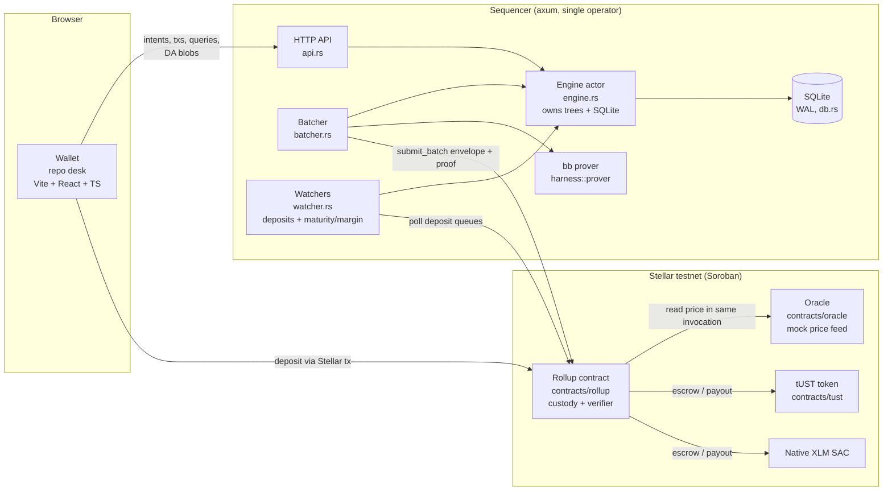

# Cellarium — Architecture Overview

Cellarium is a **private bilateral repo venue** built as a ZK-rollup
(**validium**) on Stellar testnet. Cash (native XLM) is lent against
tokenized-Treasury collateral (a mock SEP-41 token, `tUST`) at a fixed term
and rate. All position data — sizes, rates, counterparties — lives off-chain
inside a Noir circuit; each batch of activity settles on Stellar as **one
UltraHonk proof**, and only escrow totals, state roots, and commitments touch
the chain.

This document is the map: what the components are, how they talk to each
other, and where the trust boundaries sit. For byte-level hash layouts,
domains, and message formats see [DESIGN.md](../DESIGN.md) (the single source
of truth shared by circuits, contract, and harness). For the project plan see
[PLAN.md](../PLAN.md); for measurements see [REPORT.md](../REPORT.md);
for proving throughput see [PROVING.md](PROVING.md); for the test strategy
see [TESTING.md](TESTING.md).

## System diagram



## Components

| Component | Path | Role |
|---|---|---|
| Circuits | `circuits/` | Noir batch state-transition circuit (`batch_repo`) plus the shared library (`circuits/lib`) and benchmark variants (`batch_n4..n256`). Proves every root advance. |
| Rollup contract | `contracts/rollup/` | Soroban contract: two-asset custody, per-asset FIFO deposit queues, `submit_batch` verifying the UltraHonk proof, timestamp window + oracle price binding, inline withdrawals, deposit-refund path. |
| tUST | `contracts/tust/` | Mock collateral token: pure Soroban SEP-41, 7 decimals, admin mint, supply capped ≤ `u64::MAX` base units (a safety invariant, see below). |
| Oracle | `contracts/oracle/` | Mock price oracle: admin-set XLM-per-tUST × 1e7 plus ledger timestamp, loosely Reflector-shaped. |
| Harness | `harness/` | Shared Rust library: both Merkle trees, Grumpkin keys/Schnorr, Poseidon2 (through a Soroban `Env`, so off-chain ≡ on-chain by construction), batch witness builder, interest math, `bb` prover driver. Used by the sequencer and by tests. |
| Sequencer | `sequencer/` | The long-running operator backend (axum): mempool + intent matching, watchers, batch/prove/submit pipeline, DA + state HTTP API. |
| Wallet | `wallet/` | Browser repo desk (Vite + React + TS): balances, deposit/withdraw, post/countersign intents, live accrued interest and liquidation price per position, borrower close. Has its own TS crypto stack (Poseidon2, Grumpkin Schnorr, Merkle) vector-tested against the harness. |

## The rollup model in one paragraph

The L2 state is two depth-8 Poseidon2 Merkle trees — an **account tree**
(256 accounts: `pk_x`, cash, collateral, nonce) and a **position tree**
(256 open repos) — combined into one on-chain root:
`state_root = Poseidon2([account_root, position_root])`. Accounts are keyed
by Grumpkin public-key x-coordinates; authorization is hand-rolled Schnorr
over Grumpkin, verified in-circuit. Each batch proves the 8-public-input
relation `(old_state_root, new_state_root, deposit_hash, withdraw_hash,
da_commitment, batch_ts, price, instance_id)`. The contract supplies
`old_state_root` from storage, recomputes `deposit_hash` from its own queues,
appends `instance_id` from its own address (no cross-instance replay), binds
`batch_ts` to the ledger clock (claimed ≤ ledger ≤ claimed + 60s) and `price`
to a fresh (≤ 5 min) oracle read in the same invocation — then verifies the
proof and swaps in `new_state_root`.

**Validium**: transaction data never touches the chain. The blob lives in
the sequencer's SQLite, is served at `GET /da/:batch_num`, and is bound by
`da_commitment` — a Poseidon2 fold over every active off-chain-originated
operation in application order.

## Batch operations

One `batch_repo` proof covers, in this fixed application order
(4 deposits → 2 closes → 2 defaults/liquidations → 2 opens → 4 payments;
inactive slots are padded and freeze the accumulators):

1. **Deposit** — consumed from the contract's per-asset FIFO queues; the
   envelope pins how many entries of each queue the batch consumes, and the
   contract recomputes the fold over exactly those prefixes. A queue head
   stuck for 24 h can be refunded permissionlessly (`refund_deposit`).
2. **Repo open** — bilateral. Party A posts a half-signed *intent*
   (counterparty, cash, collateral, rate, haircut, term); the sequencer shows
   it only to the named counterparty; party B countersigns. The circuit
   verifies both signatures, the lender's cash, the borrower's collateral,
   and open-time collateral adequacy at the bound oracle price, then moves
   cash to the borrower and collateral into the position (title-transfer
   analog).
3. **Close (repay)** — borrower-signed, only before maturity. Interest is
   annualized ACT/360 on seconds with floor division enforced in-circuit:
   `interest = ⌊cash · rate_bps · elapsed / (10⁴·360·86400)⌋`.
4. **Default** — permissionless once `batch_ts > maturity_ts`: lender gets
   the collateral, borrower keeps the cash. No signature — validity comes
   solely from the condition holding at the bound `batch_ts`.
5. **Liquidation** — permissionless on a margin breach at half the initial
   haircut, at the bound oracle price, division-free:
   `coll·price·2·10⁴ < cash·(2·10⁴+haircut)·10⁷`.
6. **Payment / withdrawal** — plain signed L2 transfers; withdrawals are
   executed inline by the contract (≤ 4 per batch, matching the circuit's
   payment slots).

## Sequencer internals

The sequencer is structured around a single **engine actor**
([engine.rs](../sequencer/src/engine.rs)): one OS thread owning the Merkle
trees, the SQLite connection, and every state mutation. HTTP handlers,
watchers, and the batcher talk to it over an mpsc channel, which serializes
admission checks against batch building (no TOCTOU) and sidesteps the fact
that neither `soroban_sdk::Env` nor `rusqlite::Connection` is `Sync`.

- **API** ([api.rs](../sequencer/src/api.rs)) — axum routes: submit
  payments/intents/countersigns/closes; query `/account/:pk_x`,
  `/positions/:pk_x`, `/intents/:pk_x`, `/history/:pk_x`, `/da/:batch_num`,
  `/batches`, `/status`, `/params`. Intent and position listings are
  counterparty-filtered and gated by a signed read-auth challenge
  (`DOMAIN_AUTH`, ±300 s window).
- **Watchers** ([watcher.rs](../sequencer/src/watcher.rs)) — the deposit
  watcher polls the contract's FIFO queues by cursor (not events, which have
  an RPC retention window); queue seqs are exactly-once by construction and
  the engine dedupes on insert. The maturity/margin watcher runs each tick
  over open positions and enqueues defaults/liquidations idempotently per
  slot.
- **Batcher** ([batcher.rs](../sequencer/src/batcher.rs)) — ticks on
  `TICK_SECS`; batches **eagerly** (more than one op pending, or any
  default/liquidation due, builds immediately; queue-full and a max-wait
  timer catch lone ops). Runs the blocking `bb` prove off the async runtime,
  then submits and confirms. Per-batch state machine:
  `building → proving → proved → submitting → submitted → confirmed`
  (`failed` requeues the inputs).
- **Persistence** ([db.rs](../sequencer/src/db.rs)) — SQLite, WAL +
  `synchronous=FULL`; rows written before irreversible actions are the
  crash-recovery ground truth. DA blobs live here.
- **Chain access** ([stellar.rs](../sequencer/src/stellar.rs)) — via the
  Stellar CLI plus raw JSON-RPC for polling, behind a trait for a future
  native-client swap.

## Cross-stack consistency

The same cryptography is implemented three times — Noir (circuits), Rust
(harness, which the contract shares via `soroban_poseidon`), and TypeScript
(wallet). Consistency is maintained by:

- **DESIGN.md as the single source of truth** for domains, layouts, and
  formats — a constant change there must land in all three stacks together.
- The harness computing Poseidon2 **through a Soroban `Env`**, so off-chain
  and on-chain hashing are the same code path.
- **Golden vectors**: fixtures pinned across circuit tests
  (`fixtures/`), harness tests, and wallet vitest suites (interest math,
  signing messages, tree roots). See [TESTING.md](TESTING.md).

## Toolchain (pinned)

nargo 1.0.0-beta.11 · bb 0.87.0 · soroban-sdk 26.0.0 ·
ultrahonk-soroban-verifier (NethermindEth, pinned rev) · Rust with
`wasm32v1-none`. Proofs are UltraHonk over BN254 with a **Keccak
transcript**, non-ZK, non-recursive: 456 fields / 14,592 bytes, 8 public
inputs. Exact versions and verifier invariants: DESIGN.md §Toolchain.

## Trust model

- **State validity is trustless** (within the single-operator model): every
  root advance is proven; bilateral opens, borrower-only closes,
  condition-gated defaults/liquidations, exact interest, and per-asset value
  conservation are all circuit-enforced (invariant-by-invariant map in
  REPORT.md).
- **Batch submission is operator-only**: the constructor pins the sequencer
  address. This is a deliberate mitigation — without in-circuit `pk_x`
  uniqueness, a permissionless prover could initialize a duplicate account
  slot and replay published signatures (issue #1 H1).
- **Data availability is trusted** to the sequencer operator: withholding a
  blob freezes the system (users can't recompute Merkle paths for newer
  roots) but cannot steal funds.
- **The oracle is a mock** (admin-set): margining is only as honest as the
  feed.
- **Balance overflow** is prevented by a deployment invariant, not per-key
  tracking: each custody token's total supply must be ≤ `u64::MAX` base
  units (XLM natively; tUST enforces it in mint). The circuit conserves
  value per asset, so every balance ≤ escrow ≤ supply.
- **Timestamps can't be future-dated**: the contract's one-sided window
  means a batch can never trigger a premature default.

Production hardening path (out of spike scope, tracked in DESIGN.md and
REPORT.md): forced exits / censorship resistance, a DA committee over
`da_commitment`, in-circuit `pk_x` uniqueness, a real oracle (Reflector),
VK rotation, sequencer decentralization, and a ZK-flavored proof (the pinned
verifier is non-ZK-only, so witness privacy against proof-holders is
currently heuristic).

## Repository layout

```
circuits/       Noir: batch_repo (production circuit), lib (shared), batch_n* (benchmarks)
contracts/      Soroban: rollup (custody + verifier), tust (mock collateral), oracle (mock feed)
harness/        Shared Rust: trees, keys, Poseidon2, witness builder, interest math, prover driver
sequencer/      Operator backend: API, engine actor, watchers, batcher, SQLite, chain client
wallet/         Browser repo desk: React UI + independent TS crypto stack
fixtures/       Golden vectors pinned across circuit/harness/wallet tests
scripts/        Bootstrap, e2e (local + testnet)
docs/           This file, PROVING.md (throughput), TESTING.md (test architecture)
```

## Where to go next

- **Hash/message formats, domains, envelope shape** → [DESIGN.md](../DESIGN.md)
- **Milestones, security invariants, agreed refinements** → [PLAN.md](../PLAN.md)
- **Measured costs (circuit, proving, on-chain) and verdicts** → [REPORT.md](../REPORT.md)
- **Proving latency vs the 5 s ledger, recursion analysis** → [PROVING.md](PROVING.md)
- **Test inventory, gap analysis, layered test architecture** → [TESTING.md](TESTING.md)
